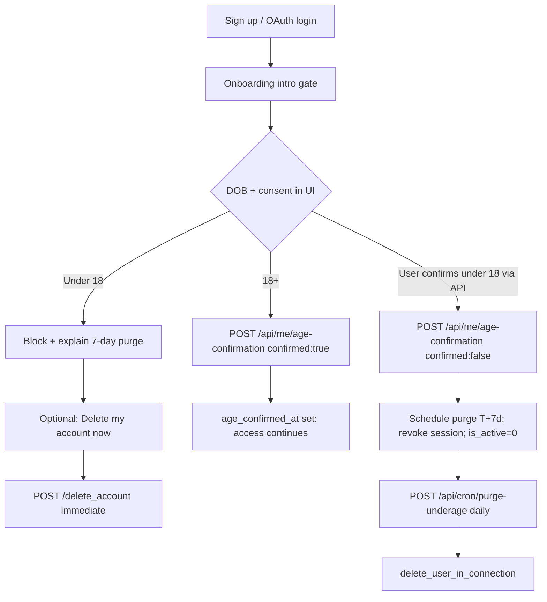

# Internal compliance memo — 18+ age gate (Option A)

> **Audience:** Engineering, product, legal review, store compliance (App Store / Play Console).  
> **Implementation:** `backend/services/user_age_gate.py`, `POST /api/me/age-confirmation`, `POST /api/cron/purge-underage`.  
> **Related:** [`PRODUCT_JOURNEYS.md`](PRODUCT_JOURNEYS.md) § Age gate, [`MYSQL_AND_FIRESTORE.md`](MYSQL_AND_FIRESTORE.md) (`users` columns), [`cloud-scheduler-cron.md`](cloud-scheduler-cron.md) (`purge-underage` job).

---

## 1. Purpose and scope

C-Point is an **18+** professional networking platform. This memo documents the **Option A** age gate: we verify eligibility at onboarding without persisting date of birth or birth year on the server.

**In scope**

- First-run onboarding after sign-up (web and Capacitor).
- Server-side record of **self-declaration outcome** (confirmed 18+ vs declared under 18).
- Deferred deletion of underage accounts after a **7-day grace period**, completed by cron.

**Out of scope (explicitly)**

- Storing DOB, birth year, or derived age on the age-confirmation API or in the three gate columns.
- Using legacy profile fields `users.date_of_birth` / `users.age` for the gate (those remain optional profile/onboarding data and must not be written by `POST /api/me/age-confirmation`).

**Grandfathering:** Accounts with `age_confirmed_at` set before deploy are treated as confirmed. Accounts with all gate columns `NULL` after deploy must complete the gate on next authenticated session (enforcement may land in a follow-up PR; storage and purge paths are live first).

**Regulatory note:** Counsel and EU data-protection guidance reviewed for this design confirm that **timestamp-only confirmation** (plus a boolean consent flag) is sufficient audit evidence when the user explicitly declares 18+ in the UI — we do **not** need to retain DOB on the server for compliance purposes.

---

## 2. Legal basis

| Framework | Basis | Application |
|-----------|--------|-------------|
| **GDPR Art. 6(1)(c)** | Processing necessary for compliance with a **legal obligation** | EU member-state and EU-wide duties to prevent minors from accessing adult-oriented online services where age limits apply; documented internal age policy for an 18+ product. |
| **Digital Services Act (DSA)** | Age-appropriate design and protection of minors on intermediary services | Gate before full platform access; underage users cannot proceed; accounts declared under 18 are removed. |
| **Transparency** | Privacy policy + in-app legal footnote | User-facing copy states collection is for legal compliance (DSA) and 18+ eligibility; see i18n `onboarding_intro.legal_footnote`. |

**Counsel review:** Placeholder — attach signed legal opinion or ticket ID when available. Engineering treats this memo as the technical control description paired with that review.

---

## 3. Data minimization — Option A

**Option A (chosen): timestamp-only server storage.** Rejected alternatives included storing birth year or full DOB on `users` (higher sensitivity, broader retention obligations).

### 3.1 What we store (MySQL `users`)

| Column | Type | When set | Meaning |
|--------|------|----------|---------|
| `age_confirmed_at` | `DATETIME NULL` | User confirms 18+ | UTC timestamp of successful self-declaration |
| `age_consent_given` | `TINYINT(1) NULL` | Gate answered | `1` = confirmed 18+; `0` = declared under 18; `NULL` = not answered |
| `underage_delete_scheduled_at` | `DATETIME NULL` | User declares under 18 | UTC time when cron may hard-delete the account (`now + 7 days`) |

**Not stored:** `dob_year`, date of birth, age integer, or any DOB sent from the client on `POST /api/me/age-confirmation` (body is `{ "confirmed": true | false }` only).

### 3.2 Client-only DOB (UX)

The onboarding UI may collect DOB in a **native date picker** to compute 18+ eligibility **in the browser**. That value:

- Is used only for pass/fail and underage messaging.
- Is **not** sent to the server on the Option A path.
- May be mirrored in **localStorage** (`cpoint:age_gate_confirmed_at`) as a UX cache to skip the step; server truth remains the three columns above.

### 3.3 Legacy profile fields

`users.date_of_birth` and `users.age` pre-date this gate and serve profile/onboarding flows. They are **not** part of Option A and must not be populated by the age-confirmation endpoint.

---

## 4. User flows



### 4.1 Confirm 18+

1. User passes client-side DOB/consent checks.
2. Client calls `POST /api/me/age-confirmation` with `{ "confirmed": true }` (session required).
3. Server sets `age_confirmed_at = UTC now`, `age_consent_given = 1`, clears `underage_delete_scheduled_at`, sets `is_active = 1`.
4. Response: `{ "success": true, "status": "confirmed", "age_confirmed_at": "<iso>" }`.
5. Idempotent re-post returns `already_confirmed`.

### 4.2 Declare under 18

1. Client calls `{ "confirmed": false }` (or user chooses delete-from-underage modal → immediate `/delete_account` remains available).
2. Server sets `age_consent_given = 0`, `underage_delete_scheduled_at = now + 7 days`, `age_confirmed_at = NULL`, `is_active = 0`.
3. Sessions revoked: `session_revocation.bump_session_version`, `remember_tokens.revoke_for_user`, profile cache invalidation; response clears session cookies (same pattern as logout/delete).
4. Response: `{ "success": true, "status": "scheduled_deletion", "purge_at": "<iso>" }`.

### 4.3 Immediate self-service delete

`POST /delete_account` continues to **immediately** purge via `account_deletion.delete_user_in_connection` for users who choose explicit deletion (including from the underage modal). This is independent of the 7-day schedule unless only the schedule path was taken.

---

## 5. Retention and erasure

| State | Retention | Erasure |
|-------|-----------|---------|
| **Confirmed 18+** | `age_confirmed_at` + `age_consent_given=1` retained for life of account (legal evidence of eligibility at confirmation time) | Removed when account is deleted by user or admin |
| **Declared under 18** | Account row retained **at most 7 days** (`UNDERGAGE_PURGE_DAYS`) from `underage_delete_scheduled_at` | Cron `purge_due_underage_accounts` → `delete_user_in_connection` (MySQL + Firestore cleanup per existing deletion service) |
| **Client DOB** | Not on server | N/A |

**Cron:** `POST /api/cron/purge-underage` — daily **03:30 UTC** on production `cpoint-app` (see [`cloud-scheduler-cron.md`](cloud-scheduler-cron.md)). Supports `?dry_run=1` and `?limit=N`. Production responses return **counts only** (no username list).

---

## 6. Processors, subprocessors, and logs

| System | Role |
|--------|------|
| **Cloud SQL (MySQL)** | Stores the three gate columns |
| **Cloud Scheduler** | Invokes purge cron with `X-Cron-Secret` |
| **Application logs** | May log `username`, `purge_at`, action codes — **never DOB** (not received) |

Structured logs use `user_age_gate.*` logger names. Operators use log counts and cron JSON (`purged`, `due`, `error_count`) for audits.

---

## 7. Data subject rights

| Right | Handling |
|-------|----------|
| **Access** | No separate export of age-gate fields; confirmation timestamp may appear in a broader account export if product adds one |
| **Rectification** | Gate is binary; underage path ends in deletion — user must create a new account after turning 18 |
| **Erasure** | Underage: automatic after grace period or immediate via `/delete_account`; confirmed users: erasure via normal account deletion |
| **Restriction** | Underage path sets `is_active = 0` and revokes access until purge |

There is no legitimate interest processing of DOB on the server under Option A.

---

## 8. Security controls

- **Authentication:** `POST /api/me/age-confirmation` requires Flask session; 401 if absent.
- **CSRF:** Standard origin enforcement (not exempt unlike cron).
- **Cron auth:** `X-Cron-Secret` == `CRON_SHARED_SECRET`; 403 otherwise.
- **Session hygiene:** Underage path revokes remember-me and session cookies on response.
- **Enumeration:** No public API listing scheduled underage users; cron errors omit usernames in production JSON.
- **Idempotency:** Confirm and schedule paths safe to retry; purge skips already-deleted rows.

Follow-up (separate PR): API middleware blocking feed/chat/Steve until `get_age_gate_status` is `confirmed` — coordinate with security review.

---

## 9. Operational runbook

### 9.1 Verify columns exist

On deploy, `user_age_gate.ensure_age_gate_columns()` runs idempotent `ALTER TABLE` (also in CI via `tests/conftest.py`).

### 9.2 Dry-run purge (staging or prod)

```bash
BASE=https://cpoint-app-staging-739552904126.europe-west1.run.app
SECRET=$(gcloud secrets versions access latest --secret=cron-shared-secret-staging)

curl -fsS -X POST "$BASE/api/cron/purge-underage?dry_run=1" \
  -H "X-Cron-Secret: $SECRET" --data ""
```

Expect `{ "success": true, "dry_run": true, "due": N, "purged": 0 }`.

### 9.3 Scheduler job

Job name: **`purge-underage`** (staging: **`staging-purge-underage`**). Registered in [`cloud-scheduler-cron.md`](cloud-scheduler-cron.md) §2. Pause via §6 bulk loop if needed during DB maintenance.

### 9.4 Incidents

| Symptom | Action |
|---------|--------|
| Cron 403 | Verify `CRON_SHARED_SECRET` on Cloud Run matches Scheduler header secret |
| `purged` < `due` | Check logs for `user_age_gate.purge_due failed`; re-run after fixing FK/deletion errors |
| Underage user still active | Confirm `is_active=0` and session revocation; check client still calling age-confirmation API |

### 9.5 Deploy order

1. Backend with columns + routes + cron  
2. Register Scheduler job (staging first, dry-run, then prod)  
3. Client gate wired to `POST /api/me/age-confirmation`  
4. Optional API enforcement middleware  

---

## 10. Store disclosures (Play Console Data Safety)

For **Google Play Console → Data safety**:

- **Data type:** “Other” / app activity or personal info as appropriate — **age-related eligibility confirmation** (not date of birth stored on device/server for Play’s purposes beyond transient UI entry).
- **Purpose:** **Legal compliance** (DSA / age-appropriate access).
- **Collection:** Minimal — server stores confirmation timestamp and boolean outcome only (**Option A**).
- **Sharing:** Not shared with third parties for advertising.
- **Retention:** Underage scheduled accounts **purged within 7 days**; confirmed users retain timestamp until account deletion.

See also [`STORE_BILLING_SETUP.md`](STORE_BILLING_SETUP.md) § Google Play Console.

---

## 11. Change log

| Version | Date | Author | Summary |
|---------|------|--------|---------|
| 1.0 | 2026-06-02 | Engineering (cpoint-lead plan) | Initial Option A memo: Art. 6(1)(c) + DSA, three `users` columns, `/api/me/age-confirmation`, `/api/cron/purge-underage`, 7-day retention, timestamp-only regulatory acceptance |
