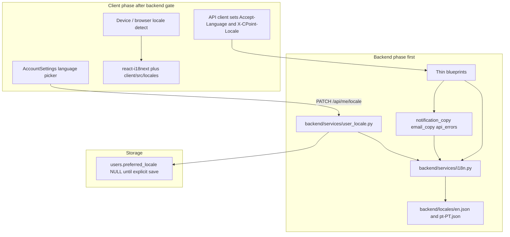

# i18n roadmap

Canonical reference for the C-Point multi-language epic.

**Status (2026-06-07):** The **pt-PT finish** epic is complete — client
catalogs (including onboarding-chat), backend catalogs (including
`steve_welcome.*`, `feed.*`, `calendar.*`, `templates.*`), Steve system
posts at owner locale on create, user-facing monolith API messages, auth
HTML templates, and CI catalog checks for nested client locale dirs.
**pt-PT pass 2** (2026-06-07) closed feed sub-pages (Key Posts / Media /
Forum), CommunityFeed story stragglers, `calendar.errors.*` validation
messages, and monolith wave-2 member API copy (delete reply, block/unblock,
community update, update-email errors).
German (`de`) remains a separate epic after QA sign-off on staging.

This is a **living engineering doc**. Update it in the same PR as any
i18n-related change (see [`AGENTS.md` § Living engineering docs](../AGENTS.md)
and [`docs/AGENT_TASK_CHECKLIST.md`](AGENT_TASK_CHECKLIST.md)).

The product policy / pricing / caps source of truth remains the in-app
Knowledge Base. This document is **engineering structure** for
internationalization only.

---

## 1. Restore point (pre-epic GitHub backup)

A full snapshot of `staging` was pushed to GitHub before any i18n work
started. Use this if a rollback is ever needed.

| Field | Value |
|-------|-------|
| Backup branch | `backup/pre-i18n-20260519` |
| Backup tag | `pre-i18n-20260519` |
| Source branch | `staging` |
| Commit SHA | `c4db6b4c97b18885285880c2b594bbe2aa88d2e7` |
| Commit subject | `Show Premium standard price with early-adoption subline.` |
| Date | 2026-05-19 |
| Working branch | `feat/i18n` (epic merges land here first) |

### Restore procedure

```bash
git fetch origin
git checkout backup/pre-i18n-20260519
# or, to inspect the tagged snapshot in detached HEAD:
git checkout pre-i18n-20260519
```

Do **not** delete or force-update the backup branch or tag during the
epic. Once Phase 2 is fully shipped and stable for one release, the tag
may be retained (recommended) while the branch can be retired.

---

## 2. Scope

### In scope (v1)

| Surface | Treatment |
|---------|-----------|
| `client/` React app — all user-facing UI | Localized via `react-i18next` |
| Backend API responses (errors + success messages) | Localized via `backend/services/i18n.py` |
| Push notifications (title + body) | Localized to **recipient** locale |
| Transactional email | Localized to **recipient** locale |
| `templates/*.html` (auth flows, RSVP, etc.) | Localized |
| Account Settings language picker | New section after Notifications |
| Auto-detect locale | Device / browser; explicit pick on first login welcome (`OnboardingIntroGate`) |

### Out of scope (v1)

| Surface | Reason |
|---------|--------|
| `admin-web/` | Internal ops tool; stays English |
| `landing/` | Marketing; covered separately if needed |
| Knowledge Base seeds + admin KB UI | Users do not browse KB; ops content only |
| Notion hub | Not user-facing; no translation sync |
| Steve LLM prompts | Already locale-aware at runtime |
| User-generated content (posts, DMs, comments) | Never translated |

### Locales (v1)

- `en` — default and source of truth
- `pt-PT` — European Portuguese, **tu** tone

Architecture supports adding further locales by dropping in a new JSON
catalog plus catalog completeness CI.

---

## 3. Locked product decisions

| Decision | Spec |
|----------|------|
| Default locale | `en` |
| First localized locale | `pt-PT` |
| pt-PT tone | **Tu** (informal European Portuguese) |
| Detection | Auto-detect until first login welcome; then `preferred_locale` on server |
| Persistence | `users.preferred_locale` is set **only** when the user explicitly picks in Account Settings |
| Before explicit choice | Client sends `Accept-Language`; backend uses it for API / push / email |
| Settings UI placement | `client/src/pages/AccountSettings.tsx`, new "Language" section immediately after the Notifications block (before Danger Zone) |
| Switching language | Applies immediately in UI, persists via `PATCH /api/me/locale` |

### Locale resolution order (server)

```text
1. users.preferred_locale (explicit Account Settings choice)
2. X-CPoint-Locale request header (client's active locale)
3. Accept-Language request header
4. en (fallback)
```

Unsupported locales fall through to `en`. `pt-BR` and any other
Portuguese variant currently map to `pt-PT` for the v1 Portugal launch;
revisit when a true `pt-BR` locale is added.

---

## 4. Architecture



### Key modules (created during the epic)

| Module | Role |
|--------|------|
| `backend/services/i18n.py` | `t(key, locale, **params)`, fallback chain, plural rules, missing-key logging |
| `backend/services/user_locale.py` | Read/write `users.preferred_locale`, resolve from request |
| `backend/services/api_errors.py` | Standard JSON helper: returns `message_key`, `message`, `message_params` |
| `backend/services/notification_copy.py` | Push title/body templates by event type, resolved to recipient locale |
| `backend/services/email_copy.py` *(or per-domain modules)* | Transactional email templates by locale |
| `backend/locales/{en,pt-PT}.json` | Catalogs grouped by namespace |
| `client/src/i18n/` | `react-i18next` setup, auto-detect, locale persistence |
| `client/src/locales/{en,pt-PT}.json` | Client catalogs |

---

## 5. API contract (backward compatible)

All migrated endpoints extend their payload with stable keys but keep
the legacy `message` field populated with the localized string, so old
client builds continue to work.

```json
{
  "success": false,
  "error": "entitlements_error",
  "reason": "monthly_steve_cap",
  "message_key": "entitlements.monthly_steve_cap",
  "message": "Usaste todas as 100 chamadas Steve deste mês.",
  "message_params": {
    "steve_uses_per_month": 100
  },
  "cta": {
    "type": "manage",
    "label_key": "cta.see_usage",
    "label": "Ver a minha utilização",
    "url": "/settings/membership/ai-usage"
  }
}
```

### Headers

| Header | Direction | Purpose |
|--------|-----------|---------|
| `Accept-Language` | Client → Server | Standard hint, always set by the client wrapper |
| `X-CPoint-Locale` | Client → Server | Explicit active locale (overrides `Accept-Language` when present) |

---

## 6. Namespace convention

Top-level keys group user-visible copy by domain. Keep names stable —
the frontend, tests, and translators all reference them.

| Namespace | Use |
|-----------|-----|
| `common.*` | Buttons, generic words (save, cancel, retry, loading) |
| `auth.*` | Login, signup, password reset, verification |
| `onboarding.*` | First-run flows, welcome cards |
| `account.*` | Account Settings, profile editing, language picker |
| `communities.*` | Community creation, listing, membership, invites |
| `feed.*` | Feed, posts, comments, reactions |
| `chat.*` | DMs, group chat, message bubbles, composer |
| `notifications.*` | In-app + push notification copy |
| `email.*` | Transactional email subjects + bodies |
| `entitlements.*` | Plan limits, denial messages, CTAs |
| `billing.*` | Subscriptions, Stripe paths, IAP, manage membership |
| `errors.*` | Generic error fallbacks (network, server, validation) |
| `time.*` | Relative times (`just now`, `yesterday`, weekday names) |

Compound keys use dotted paths: `entitlements.monthly_steve_cap.message`,
`auth.signup.email_already_in_use`, etc. Avoid English sentences as
identifiers.

---

## 7. pt-PT style guide

European Portuguese only. Reject Brazilian variants in review.

### Tone

- **Use `tu`** for all UI, push, and email copy.
  - "A tua conta", "Guardaste as alterações", "Tens uma nova mensagem"
- Imperatives: `Guarda`, `Abre`, `Experimenta`, `Inicia sessão`, `Regista-te`
- Avoid `você` / formal business tone unless quoting third-party legal copy.

### Reject list (Brazilian → European)

| Reject (pt-BR) | Use (pt-PT) |
|----------------|-------------|
| `você`, `vocês` | `tu`, `vós` / 2nd person plural via verb |
| `celular` | `telemóvel` |
| `tela` | `ecrã` |
| `arquivo` | `ficheiro` |
| `time` (sport sense) | `equipa` |
| `bate-papo` | `conversa`, `chat` |
| `e-mail` (in body) | `email` |
| `cadastro` | `registo` |
| `senha` | `palavra-passe` (or `password` is acceptable in product UI) |
| `usuário` | `utilizador` |

### Keep in English (all locales)

- **C-Point**, **Steve**, **Premium**, **Enterprise** (product names / tier names)
- URLs, emoji, code snippets, third-party brand names
- Usernames, community names, user-generated content

### Translator workflow

1. Engineer adds the English string to `backend/locales/en.json` (and/or
   `client/src/locales/en.json`) with a stable key.
2. CI inventory flags the new key as missing in `pt-PT`.
3. Translator opens a PR editing only `pt-PT.json`, never English.
4. Optional: a glossary file (`backend/locales/glossary-pt-PT.md`) tracks
   recurring terms so reviewers can verify consistency.

---

## 8. Engineering rules (for every PR)

- **Blueprints stay thin.** All copy lives in `backend/services/*.py`
  helpers or JSON catalogs. Blueprint handlers call
  `i18n.t()` / `api_errors.error_response(...)` only.
- **No new routes** in `bodybuilding_app.py`. New HTTP goes in
  `backend/blueprints/`.
- **Monolith pages** in `client/src/pages/` (e.g. `CommunityFeed.tsx`,
  `ChatThread.tsx`, `GroupChatThread.tsx`, `OnboardingChat.tsx`,
  `AdminDashboard.tsx`): **string extraction only**. Net line count
  flat or down. No feature work in the same PR.
- **Stable keys.** Tests should switch on `message_key`, not on English
  sentence text.
- **Backward compatible.** Until a client is migrated, keep `message`
  populated with the localized string and `error` / `success` fields
  unchanged.
- **Recipient locale for async surfaces.** Push and email always
  resolve the **recipient's** `preferred_locale` (or their last known
  `Accept-Language`), not the sender's session.
- **Living docs updated in the same PR** — see § 10 below.

---

## 9. PR sequence

### Phase 1 — Backend (PRs 0–12)

All work lands on `feat/i18n` before merging to `staging`.

| PR | Title |
|----|-------|
| 0  | Backup + roadmap + inventory script |
| 1  | Core i18n service + catalogs |
| 2  | User locale storage + `/api/me/locale` |
| 3  | Shared API errors helper + auth migration |
| 4  | Entitlements + billing |
| 5  | Communities + invites + onboarding bootstrap |
| 6  | Push + in-app notification copy |
| 7  | Email + HTML templates |
| 8  | Onboarding + Steve API errors |
| 9  | Group chat + DM API copy (services only — no blueprint growth) |
| 10 | Remaining blueprints (media, calendar, enterprise, iap, public, …) |
| 11 | Monolith string pass (`bodybuilding_app.py`) — strings only |
| 12 | Backend gate (docs, QA checklist, inventory zero) |

### Phase 2 — Client (PRs 13–23, after backend gate merges)

| PR | Title |
|----|-------|
| 13 | Client i18n infrastructure (react-i18next, auto-detect, fetch headers) |
| 14 | Shared utils + `content/*.ts` migration (dates, manifesto, onboarding copy) |
| 15 | Auth + onboarding |
| 16 | Shell + Account Settings language picker |
| 17 | Communities |
| 18 | Feed + posts |
| 19 | Chat chrome (shared `client/src/chat/`) |
| 20 | Subscriptions + Manage Membership |
| 21 | Profile, members, networking, notifications, calendar |
| 22 | Remaining client surfaces |
| 23 | QA + CI completeness check |

---

## 10. Documentation rules (same PR as the change)

| Trigger | Document |
|---------|----------|
| New route (e.g. `/api/me/locale`) | Regenerate [`docs/BACKEND_ROUTES.md`](BACKEND_ROUTES.md) via `python scripts/generate_route_inventory.py` |
| `users.preferred_locale` column | [`docs/MYSQL_AND_FIRESTORE.md`](MYSQL_AND_FIRESTORE.md) |
| Locale journey (detect → persist → push/email) | [`docs/PRODUCT_JOURNEYS.md`](PRODUCT_JOURNEYS.md), new "Locale & i18n" section |
| i18n service + catalog layout | [`docs/C_POINT_ARCHITECTURE.md`](C_POINT_ARCHITECTURE.md), new subsection |
| Manual QA for PT flows | [`docs/QA_CHECKLIST.md`](QA_CHECKLIST.md), new i18n section |
| Agent guardrails | [`docs/AGENT_TASK_CHECKLIST.md`](AGENT_TASK_CHECKLIST.md), pointer to this roadmap |

Notion is **not** updated for i18n content. The hub may receive a
single roadmap entry when the epic ships, but no per-PR sync.

---

## 11. PR checklist template

Use this in every i18n PR description:

```markdown
## i18n PR checklist

- [ ] Touches `backend/blueprints/` (thin) and `backend/services/` only — no monolith additions
- [ ] All new user-facing strings live in `backend/locales/*.json` or `client/src/locales/*.json`
- [ ] `en.json` updated; `pt-PT.json` updated (or translator handoff opened)
- [ ] Tests: `en` + `pt-PT` table-driven coverage for migrated keys
- [ ] Backward-compatible payload (legacy `message` field preserved)
- [ ] Recipient locale used for push / email
- [ ] Inventory script run; no regressions in migrated namespaces
- [ ] Living docs updated (see [I18N_ROADMAP.md § 10](docs/I18N_ROADMAP.md))
- [ ] Monolith files (>2k lines): net line count flat or down
```

---

## 12. Inventory tooling

`scripts/i18n_inventory.py` (added in PR 0) scans the backend and
client for unmapped user-facing English strings, grouped by file and
domain. Run locally with:

```bash
python scripts/i18n_inventory.py
```

It emits a Markdown report on stdout. Use `--json` for machine output
and `--strict <namespace>` in CI to fail the build when a migrated
namespace gains untranslated strings.

The script is intentionally a **heuristic**, not a parser; review its
matches before treating any namespace as "complete".

### Catalog drift CI

`scripts/i18n_check_catalogs.py` (added in PR 23) runs in
`.github/workflows/test.yml` (`i18n-catalogs` job) on every push and
PR. It flattens every catalog under `backend/locales/` and
`client/src/locales/`, then diffs each locale against the `en` source
of truth. The job fails if a locale is **missing** a key, has
**extra** keys not present in `en`, or has **list-length drift** (e.g.
the `onboarding.welcome.carousel` array changed length without a
matching translation).

Run locally with:

```bash
python scripts/i18n_check_catalogs.py
```

The script is stdlib-only and finishes in well under a second on the
current catalogs.

### Capacitor device locale

On native shells, `client/src/components/LocaleBootstrap.tsx` calls
`@capacitor/device.Device.getLanguageTag()` once at boot and feeds the
result through `matchLocale()`. This gives us the explicit iOS /
Android system tag before the WebView's `navigator.language` heuristic
runs, and is then immediately overridden by the user's saved
`preferred_locale` once `/api/me/locale` resolves.

---

## 13. Risks and mitigations

| Risk | Mitigation |
|------|------------|
| pt-BR vs pt-PT drift | Style guide (§ 7) + native pt-PT reviewer; CI glossary check (later) |
| KB override path returns English to a PT user | v1 ignores KB overrides for PT; resolves from catalogs |
| Push or email sent in the wrong language | Recipient locale resolved in `notification_copy` / `email_copy` services, not sender's session |
| Layout breaks (PT longer than EN) | Manual QA section in `QA_CHECKLIST.md`; visual review on staging |
| Monolith pages grow during string extraction | "Strings only, no logic" rule + diff review |
| Missing keys in production | Server falls back to `en`; missing-key logged via `logger.warning` |
